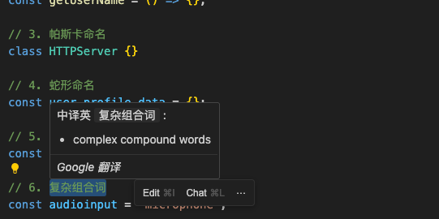

# Translate Dict for VS Code

<p align="center">
  
</p>

一款纯粹、极速、无侵入的 VS Code 滑词翻译插件，基于 **ECDICT** 本地词库构建。

[](https://marketplace.visualstudio.com/items?itemName=fengzai6.translate-dict)


[](http://opensource.org/licenses/MIT)

---

**📥 安装地址：**

- [VS Code Marketplace](https://marketplace.visualstudio.com/items?itemName=fengzai6.translate-dict)
- [Open VSX Registry](https://open-vsx.org/extension/fengzai6/translate-dict)

---

## 🚀 核心特性

- **🌍 纯正本地加速**: 内置 76 万+ 离线单词（基于 [ECDICT](https://github.com/skywind3000/ECDICT)），完全脱离网络限制，隐私安全且极速响应。
- **⚡️ 极致性能**: 英语查询平均耗时小于 **1ms**，中译英首次查询约 **160-200ms**，缓存命中后稳定在 **1ms 以内**。
- **🔗 外部翻译平台跳转**: 支持多种翻译平台（Google、百度、DeepL等），本地无结果时自动提供外部翻译链接。
- **🌐 在线回退翻译**: 开启后，当本地词库无结果时自动通过 Google / Yandex 在线 API 获取翻译，无缝补全缺失词汇（默认关闭，请在设置中开启）。
- **🖱 灵活触发模式**: 支持「悬浮即翻译」和「选中+快捷键（`Alt+T`）翻译」两种模式，可随时切换。
- **🧠 智能代码拆分**: 完美识别编程常用的命名格式：
  - 处理 `camelCase`, `PascalCase`, `snake_case`, `kebab-case`。
  - 智能解析组合词（如 `audioinput` → `audio` + `input`，`superuserprofilemanager` → `superuser` + `profile` + `manager`）。
  - 处理连续大写缩写（如 `HTTPServer` → `HTTP` + `Server`，`getURLForHTTPAPI` → `get` + `URL` + `For` + `HTTP` + `API`）。
  - 自动过滤常见接口前缀（如 `IUser` → `User`，`IUserDTOService` → `User` + `DTO` + `Service`）。
- **🔍 双向翻译**:
  - **英译中**: 悬停直接显示，支持单词、短语及各种大小写变体。
  - **中译英**: 选中中文文本悬停，智能匹配最佳英文释义（支持得分排序）。
- **💻 全平台覆盖**: 完美支持 VS Code 桌面端及 VS Code Online 网页版。

---

## 🛠 功能演示

### 1. 悬停翻译 (Hover Translation)

只需将鼠标悬停在单词上，即可查看详细释义、音标及词频等级。点击信息框首行可折叠或展开词典；原文本最多显示 3 行，超过后可单独展开或收起。点击只影响当前单词，不会改全局设置。


### 2. 智能单词拆分 (Smart Word Splitting)

自动识别并拆分复杂的变量名、类名、技术缩写及组合词，助力理解代码逻辑。


### 3. 中译英支持 (Chinese to English)

选中中文后悬停，系统将基于本地词库反向查找最匹配的英文选项。


### 4. 在线回退翻译 (Online Fallback Translation)

当本地词库无结果时，自动通过 Google / Yandex 在线 API 获取翻译，无缝补全缺失词汇（默认关闭，请在设置中开启）。


### 5. 外部翻译平台跳转 (External Translation Links)

当本地词库无结果时，自动提供多个翻译平台的跳转链接，包括Google翻译、百度翻译、DeepL翻译等，确保用户始终能获得准确的翻译结果。

**支持的翻译平台：**

- 🌐 Google翻译 - 全球通用
- 🇨🇳 百度翻译 - 中文优化
- 🤖 DeepL翻译 - AI高质量
- 🔍 必应翻译 - 微软出品
- 🌍 Yandex翻译 - 俄罗斯的翻译服务
- ⚙️ 自定义平台 - 支持任意翻译网站

---

## ⚙️ 配置选项

进入 VS Code 设置，搜索 `Translate Dict` 即可进行如下个性化配置：

| 配置项                                     | 类型    | 默认值                                     | 说明                                                                                         |
| :----------------------------------------- | :------ | :----------------------------------------- | :------------------------------------------------------------------------------------------- |
| `translateDict.includeFileExtensions`      | Array   | `[]`                                       | **启用** 翻译的文件扩展名。若为空则对所有文件生效。如 `["js", "ts"]`                         |
| `translateDict.excludeFileExtensions`      | Array   | `[]`                                       | **禁用** 翻译的文件扩展名。如 `["json", "md"]`                                               |
| `translateDict.chineseToEnglishMaxResults` | Number  | `10`                                       | 中译英时显示的候选结果最大数量 (范围: 1-50)                                                  |
| `translateDict.defaultTranslatePlatform`   | String  | `google`                                   | 默认翻译平台，用于单词链接跳转。可选：`google`、`baidu`、`deepl`、`bing`、`yandex`、`custom` |
| `translateDict.customTranslateUrl`         | String  | `https://fanyi.baidu.com/#en/zh/{word}`    | 自定义翻译平台URL模板，使用 `{word}` 作为单词占位符                                          |
| `translateDict.translationMode`            | String  | `hover`                                    | 翻译触发模式：`hover`（悬浮即翻译）或 `shortcut`（选中后按 `Alt+T` 触发）                    |
| `translateDict.defaultHoverExpanded`       | Boolean | `true`                                     | 新悬浮翻译是否默认展开词典正文；点击展开/折叠只影响当前悬浮目标                               |
| `translateDict.enableOnlineFallback`       | Boolean | `false`                                    | 本地词库无结果时，是否自动调用在线 API 回退翻译（需要网络）                                  |
| `translateDict.onlineFallbackApi`          | String  | `auto`                                     | 在线回退使用的 API：`auto`（Google 优先，失败换 Yandex）、`google`、`yandex`                 |

### 快速开关 / 模式切换

你可以通过以下任一方式快速启用/禁用插件或切换翻译模式：

1. **编辑器右键菜单**: 右键 -> `Translate Dict` -> `启用 / 禁用 / 切换翻译触发模式`。
2. **命令面板**: `Ctrl+Shift+P` (Win/Linux) 或 `Cmd+Shift+P` (Mac)，输入 `Translate Dict`。
3. **快捷键**: 在 `shortcut` 模式下，选中文本后按 `Alt+T` 触发翻译。

---

## 📊 性能基准

性能基准使用 Vitest benchmark 运行，统一从 `buildHoverPresentation` 开始，覆盖英译中、中译英和 Markdown 组装。

```bash
yarn bench --run
```

当前基准结果（Apple Silicon macOS，Node.js + Vitest）：

| 场景 | 平均耗时 | 说明 |
| :--- | :--- | :--- |
| hover 英译中主路径 | < 1ms | 包含查询、Markdown 组装，如 `hello`、`IUserDTOService` |
| hover 中译英缓存命中 | < 1ms | 包含选区查询和 Markdown 组装 |
| hover 中译英首次查询 | 160-200ms | 需要遍历本地词典并计算匹配分数 |
| 超长英文段落 | < 3ms | 多行选区，包含拆词、词典查询和 Markdown 折叠 |
| 中英混合段落 | < 2ms | 多行选区，包含英文标识符和中文说明 |
| 复杂组合词拆分 | < 1ms | 如 `supercalifragilisticexpialidocious` |

中译英首次查询需要扫描本地词典以匹配中文释义，因此耗时会明显高于普通英译中查询；相同查询会命中缓存，后续 hover 不会重复执行完整扫描。

---

## 📝 待办事项 (TODO)

- [x] 智能文件过滤（Include/Exclude）
- [x] 全局开关控制
- [x] 组合词深度解析（audioinput 等）
- [x] 本地反向查询（中译英）
- [x] 自定义外部翻译平台跳转
- [x] 翻译触发模式切换（hover / shortcut Alt+T）
- [x] 当无结果时尝试通过API获取翻译结果

---

## 🤝 致谢

- 词库来源：[ECDICT](https://github.com/skywind3000/ECDICT)
- 核心灵感：[Code Translate](https://github.com/w88975/code-translate-vscode)

## 📄 开源协议

基于 [MIT](LICENSE) 协议。
